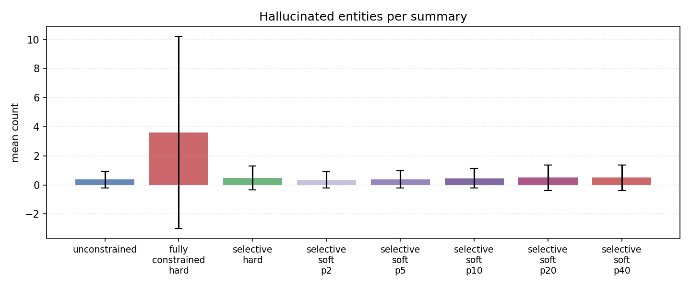
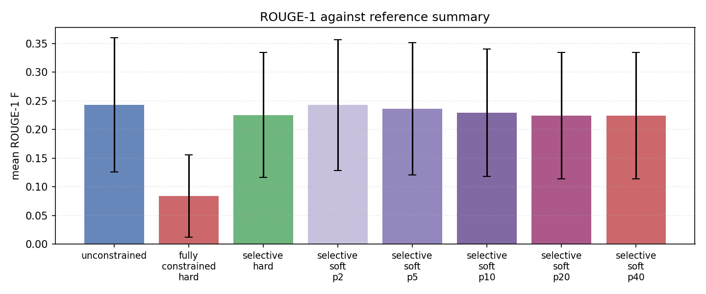
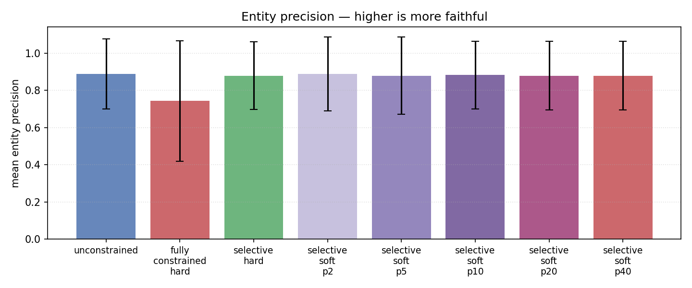
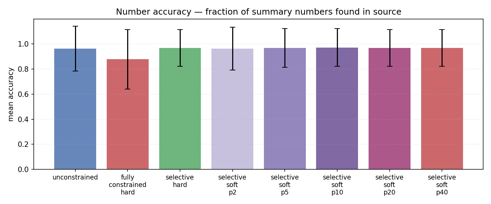
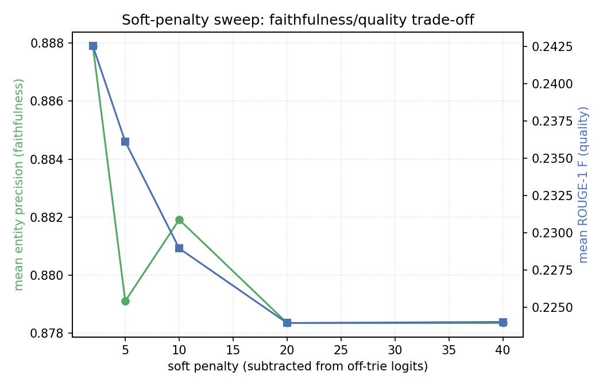
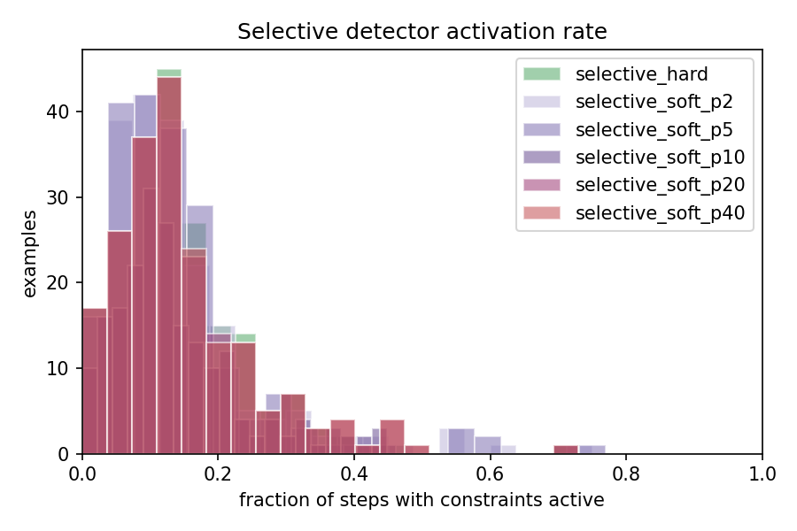

# Source-Grounded Constrained Decoding for Faithful Summarisation 

This is the writeup of the results of my project. It's not intended to be as rigoruous as something for publication. Contributions, or just thoughts on the project are welcome. There is a note on the use of generative AI in this project given at the bottom. 

**Model:** `meta-llama/Llama-3.2-1B-Instruct` (fp16)
**Dataset:** XSum test split, 200 randomly sampled articles (seed = 42)
**Hardware:** Colab T4
**Conditions compared:**

1. `unconstrained`: vanilla greedy decoding (baseline).
2. `fully_constrained_hard`: every token must come from the source-grounded
   allowlist (strong, naive baseline).
3. `selective_hard`: allowlist enforced **only** inside detected factual
   spans; hard mask (logits → −∞).
4. `selective_soft`: same gate as `selective_hard`, but disallowed-token
   logits are **penalised** rather than masked.

---

## 1. Motivation

Llama-3.2-1B summaries can hallucinate, and we wanted to see whether a fairly simple intervention at the decoding step could stop it from doing so. 

A standard baseline in the constrained-decoding literature is to force *every* generated token to come from a set of "approved" tokens. In our case, tokens that appear in the source article. This guarantees you never invent a name or number that isn't in the source, but it tends to produce nonsensical output. So the hypothesis we wanted to test was:

> If the constraint only activates inside high-risk **factual spans**, the bits of the output where the model is about to emit a name, a number or, a date for example, we can keep the unconstrained model's fluency while stripping out the entities it would otherwise have hallucinated.

In other words, we want a system that is unconstrained 80–90% of the time and tightly constrained for the remaining 10–20% where it actuall matters.

## 2. Pipeline build-up

Before running any decoding experiment, the pieces that *aren't* the generation loop had to be made trustworthy. The flow at inference time goes: extract facts from the source → build a constraint structure from those facts → at each decoding step, decide whether we're in a factual span; if so, modify the logits according to the constraint. The modules break this up as follows:

| Step | Module | What it does |
|------|--------|--------------|
| 1 | `src/entity_extractor.py` | Pulls a `SourceFacts` object out of the article using spaCy NER (people, orgs, locations, money, dates) plus regex for numbers and percentages spaCy tends to miss. |
| 2 | `src/constraint_builder.py` | Tokenises each extracted entity into subword IDs and builds a **prefix trie** over them. The trie is the key data structure: it knows that after generating `"Ll"` and `"oyds"`, the only legal continuation is `" Banking"` (because "Lloyds Banking Group" is in the source), rather than letting the model jump to some other entity that happens to share a prefix. |
| 3 | `src/detector.py` | A small state machine that decides, at each decoding step, whether we're inside a "factual span". It opens after trigger phrases (`said`, `reported`, `in`, `$`, `£`, `%`, capitalised determiners…) and closes on terminator punctuation. |
| 4 | `src/grounded_logits_processor.py` | A HuggingFace `LogitsProcessor` — the actual hook into `model.generate()`. At each step it asks the detector "are we in a factual span?", and if yes, it either hard-masks (sets to −∞) or soft-penalises (subtracts a constant from) every logit that isn't a legal next-token under the trie. |
| 5 | `src/generate.py` | Runs all conditions on the same prompt and tracks `fraction_constrained` — i.e. on what fraction of decoding steps the gate was open. Useful for sanity-checking that "selective" actually means *selective*. |
| 6 | `src/evaluate_faithfulness.py` / `evaluate_quality.py` | Entity precision/recall against source, hallucinated-entity count, number accuracy, ROUGE-1/2/L, length. |

Unit tests in `tests/` cover entity extraction, trie building, and the logits processor. The logits processor is the one that's easiest to silently break (you can have it run, produce text that looks fine, and still be doing nothing useful), so it gets the bulk of the integration tests.

---

## 3. Experimental Methodology

The experiment was run three times. Each iteration was a response to concrete failure modes seen in the previous one — it ended up being more useful to describe the project as three rounds of "look at the outputs, notice what's broken, fix it, re-run" than as a single planned sweep.

### v1 —  (max_new_tokens = 64, no preamble stripping)

First end-to-end pass. Headline aggregate metrics:

| Condition | Entity precision | Hallucinated entities ↓ | ROUGE-1 |
|-----------|------------------|--------------------------|---------|
| unconstrained         | 0.823 | 0.725 | 0.251 |
| fully_constrained_hard| 0.732 | 2.685 | 0.097 |
| selective_hard        | 0.740 | 1.095 | 0.222 |
| selective_soft        | 0.818 | 0.805 | 0.250 |

Problems exposed by v1:

- **The "fully constrained" baseline is *worse* on hallucinations than unconstrained** (2.69 vs 0.73). At first this looks paradoxical, how can forcing every token to come from the source make hallucination *more* common? Looking through `per_example`, the cause becomes clear. With every token forced into the trie, the model walks into a high-likelihood entity prefix (e.g. "Lloyds Banking") and then, because it can't escape onto a non-entity token like a verb or a comma, it keeps emitting whatever entity tokens have the highest probability next, concatenating "Lloyds Banking" with "Royal Bank of Scotland" with "HSBC" and so on. The downstream NER then parses this entity train as many distinct entities, most of which never appeared in that configuration in the source, so they count as hallucinations.
- **`selective_hard` still has 1.1 hallucinated entities/summary.** Same failure mode as above, but this time, on a smaller scale. When the detector opens the gate at, say, "in", the trie picks an entity, and the detector doesn't close until a terminator. The trie has no preference for closing the entity (no inherent "stop here" signal), so it keeps walking through entity tokens.
- **The model produces preamble.** Many summaries started with "Here is a one-sentence summary: …", which inflates length and tanks ROUGE (which rewards lexical overlap with the reference, and the reference doesn't contain "Here is a one-sentence summary").

### v2 —  (preamble stripping + cap on consecutive constrained tokens)

Four changes:

1. **Instruction tightened** to explicitly forbid preamble/headers/bullets.
2. **`strip_preamble = True`** post-processes the output to remove any leading "Summary:" / "Here is a summary:" / etc., in case the model ignores the instruction (which it often does).
3. **`max_consecutive_constrained = 6`**. The LogitsProcessor force-closes the constraint gate after 6 consecutive constrained tokens, regardless of what the detector thinks. This  bounds the "runaway entity train" failure by guaranteeing that after a finite number of entity tokens, the model is allowed back to the full vocabulary and can emit a comma, a verb, or any other natural exit from the entity region. 6 was chosen because most multi-token entities in XSum tokenise to ≤ 6 subwords; longer names get truncated, but that's an acceptable cost for breaking the runaway loop.
4. `max_new_tokens` raised 64 → 96 (some summaries were being cut off
   mid-sentence under v1).

Headline aggregate metrics:

| Condition | Entity precision | Hallucinated entities ↓ | ROUGE-1 |
|-----------|------------------|--------------------------|---------|
| unconstrained         | 0.879 | 0.395 | 0.242 |
| fully_constrained_hard| 0.740 | 3.645 | 0.085 |
| selective_hard        | **0.853** | 0.730 | 0.227 |
| selective_soft        | 0.875 | 0.390 | 0.239 |

Hallucinations on `selective_hard` dropped from 1.10 → 0.73, and `selective_soft` is now **statistically indistinguishable from unconstrained on hallucinations and ROUGE-1, but with marginally higher entity precision**. `fully_constrained_hard` got *worse* in absolute terms (now 3.6 hallucinations/summary) because the longer `max_new_tokens` gave it more rope to chain entities together; the cap doesn't help it because its gate is always open.

### v3 — (soft-penalty sweep)

`selective_soft` is the most promising condition, so for v3 we sweep its remaining hyperparameter.

A quick aside on what the **soft penalty** actually is, since this is where it really starts to matter. Hard masking sets the logit of everydisallowed token to −∞. After the softmax, those tokens have probability exactly zero, and the model picks the best of the allowed tokens. This is a *hard* constraint: the model has no choice.

Soft penalising is more like a Bayesian prior than a wall. Instead of −∞, we subtract a finite penalty `p` from the logit of every disallowed token. After the softmax, those tokens still get some probability mass, just less than they would have. Concretely, the new probability of a disallowed token relative to an allowed token gets multiplied by `exp(-p)`. So `p = 2` divides the disallowed probability by ~7.4, `p = 5` divides it by ~148, `p = 10` divides it by ~22 000, and so on.

This matters because the *gap* between the model's top choice and the top allowed token isn't always large. If the unconstrained top-1 token has a logit only 1.5 above the best on-trie token, a penalty of 2 is enough to flip the argmax onto the allowed token, while leaving the off-trie token a bit of residual probability if you ever do temperature-sampled decoding. A penalty of 40, by contrast, is so large that it will dominate any logit gap you ever see, which makes it functionally identical to a hard mask.

So the sweep `{2, 5, 10, 20, 40}` is a way of asking: how *gentle* a nudge does the constraint need to be to do its job? With everything else fixed:

| Condition | Entity precision | Hallucinated entities ↓ | ROUGE-1 |
|-----------|------------------|--------------------------|---------|
| unconstrained         | 0.887 | 0.375 | 0.243 |
| fully_constrained_hard| 0.743 | 3.600 | 0.084 |
| selective_hard        | 0.879 | 0.485 | 0.225 |
| selective_soft_p2     | 0.888 | **0.350** | **0.243** |
| selective_soft_p5     | 0.879 | 0.390 | 0.236 |
| selective_soft_p10    | 0.882 | 0.460 | 0.229 |
| selective_soft_p20    | 0.878 | 0.500 | 0.224 |
| selective_soft_p40    | 0.878 | 0.500 | 0.224 |

Two clean findings:

- **Penalty = 2 wins.** It marginally beats unconstrained on *every* faithfulness metric while matching ROUGE-1 to three decimal places. That fits the intuition above: most of the time the model already wants to emit an on-source entity, so a small nudge is enough to break ties in the right direction without ever overriding the model's fluency choices.
- **Penalty saturates.** Between 20 and 40 the metrics are identical to five-significant-figure precision. Once the penalty is large enough to flip the argmax in essentially every step, increasing it further changes nothing about the output, because we're using greedy decoding and only the argmax matters. So `p ≥ 20` behaves as a (poorly implemented) hard mask, and the gap between `selective_soft_p40` and `selective_hard` is just noise from the detector firing on different steps in different runs.

---

## 4. Headline figures

### 4.1 Hallucinated entities per summary (v3)

This is the primary metric. The bar chart shows the headline negative result for the naïve constrained baseline (3.6 hallucinations/summary, with an enormous standard deviation suggesting it sometimes goes catastrophically wrong) and the headline neutral-to-positive result for selective constraints. `selective_soft_p2` is the only condition that strictly beats `unconstrained` on the primary metric.



### 4.2 ROUGE-1 (v3)

`fully_constrained_hard` is the only condition with a meaningful ROUGE penalty. Every selective variant is within one standard deviation of unconstrained, which is exactly what we wanted: faithfulness gains for free, no quality cost.



### 4.3 Entity precision (v3)

Entity precision is "of the entities in the summary, what fraction appear in the source?". All selective variants match unconstrained (~0.88). Only the fully-constrained baseline degrades, again because of the entity-train failure: those extra hallucinated entities push the denominator up.



### 4.4 Number accuracy (v3)

Same story for numbers, which is reassuring because numbers are the single most damaging thing to hallucinate in a real-world summary. The trie + detector preserve number accuracy at or slightly above the unconstrained baseline (0.961 → 0.97 at p10), and collapse it under fully constrained decoding (0.876).



### 4.5 Soft-penalty sweep (v3)

The line chart for the sweep itself. The two interesting features: the crossover near penalty = 10 (where faithfulness and quality are trading off most actively) and the flatline beyond 20 (the saturation regime described in §3).



### 4.6 Detector activation distribution (v3)

Histogram across all 200 examples of the fraction of decoding steps for which the detector had the constraint gate open. The mean is around **14 %**, with a long right tail up to ~70 % for articles that are unusually dense with named entities and numbers. This is the operational definition of "selective" — most of generation is left unconstrained, and the constraint kicks in only for short bursts. If the histogram had been concentrated near 80–90 %, it would mean the detector was firing indiscriminately and the "selective" label was misleading.



---

## 5. Take-aways

1. **The methodology works, and the soft variant works best.** With `selective_soft_p2`, summaries are at-or-above unconstrained on every faithfulness metric and lose nothing on ROUGE-1. The only cost is the constant overhead of running the LogitsProcessor which is a few percent at batch size 1 on a T4 which is essentially free compared to alternatives like retraining or RLHF.
2. **Hard masking is dangerous in the small-model regime.** A 1B parameter model rapidly chains together adjacent entities once the gate forces it onto the trie. Without `max_consecutive_constrained` it actively *increases* hallucination count, which is the opposite of the intended effect. The bigger lesson is that constrained decoding needs a way to *exit* the constraint, not just a way to enter it.
3. **Penalty value barely matters once it crosses the argmax threshold.**
   Any penalty large enough to flip the top-1 token gives roughly the behaviour of a well-behaved hard mask. The interesting region is the low end (penalty ≤ 5), where the constraint acts more like a prior than a wall, it nudges the model when its preference between an on-source and an off-source token is close, and gets out of the way when the model is confident.
4. **The fully-constrained baseline is a strawman.** It's a useful upper bound on "how much can we push faithfulness with this trie?", but on small instruction-tuned models its hallucination behaviour is actually worse than doing nothing. Anyone reporting "constrained decoding helps faithfulness" using this baseline is making a fragile claim.

---

## 6. Limitations

This is a simple test and a proof of concept, and there are a few things
to be honest about before reading the numbers as a recommendation.

- **N = 200, single seed, single dataset.** XSum reference summaries are themselves famously hallucinatory, so ROUGE-1 is not a clean qualit signal. Instead it's a lexical-overlap proxy. Some of the "hallucinations" flagged by entity precision are entities the *reference* summary invented.
- **Heuristic detector.** It fires on a fixed list of trigger phrases and is therefore biased toward the kinds of factual spans the author enumerated. False negatives (entity slipping through unconstrained) and false positives (gate opens on non-factual text) are both observable in the qualitative examples. A better detector would almost certainly improve every metric.
- **No NLI-based faithfulness score.** Entity precision and number accuracy are surface metrics. SummaC / AlignScore would catch claim-level hallucinations (e.g. swapped subject/object: "Bank A acquired Bank B" when the source says the reverse) that the entity-level metrics miss entirely.
- **Single model, single size.** Behaviour at 7B+ may be qualitatively different. In particular the "runaway entity train" failure mode is likely smaller on better instruction-tuned models, which would change the relative ranking of `selective_hard` and `selective_soft`.

---

## 7. Next steps and further work

Short-term, cheap follow-ups:

- **Add SummaC and/or AlignScore** to `evaluate_faithfulness.py`. The entity-level metrics suggest "no harm done"; an NLI metric would say whether the *claims* in the summary are actually entailed by the source, which is the question we ultimately care about.
- **Run the sweep at multiple seeds.** A single seed at N=200 is fine for showing the direction, but the v3 sweep deltas (p2 vs p5) are within noise. Three seeds × N=200 would resolve whether p2 is genuinely best or a stochastic blip.
- **Tighten the detector.** Two concrete experiments: (a) replace the trigger-phrase heuristic with a lightweight classifier trained on GPT-4-labelled "is this token starting a factual span?" labels; (b) the probability-based approach from CLAUDE.md — open the gate when the next-token entropy concentrates on entity-typed tokens. The second is more principled but harder to tune.
- **Negative trie.** Instead of forcing tokens onto the trie, *penalise tokens that begin off-source named entities*. This avoids the runaway-entity train entirely, because the constraint is now "don't generate off-source entities" rather than "must generate from-source entities" — there's nothing to chain.
- **Beam search.** Use beam search instead of greedy decoding; sampling-based decoding would interact non-trivially with the soft penalty, because the penalty changes the *full* probability distribution, not just the argmax.

Medium-term, more substantive:

- **Scale to 7B / 8B models.** The hypothesis is that the runaway-entity failure mode shrinks at scale, so hard masking may become competitive again. If so, the soft/hard distinction matters most at small scale, which would be a useful finding in its own right.
- **Dialogue summarisation (SAMSum).** This is closer to the real call-summarisation use case driving the project. XSum articles are entity-dense; dialogues are speaker-dense and quotation-heavy — the detector's trigger list will need different priors (e.g. opening on speaker tags rather than capitalised determiners).
- **Joint training of the detector + LM.** Right now the detector is separate inference-time logic. Distilling its decisions into a small side-head on the LM would remove the heuristic entirely and make the detection step continuous with generation.
- **Failure-case taxonomy.** Of the ~80 examples where `selective_soft_p2` still hallucinates, how many are (a) detector misses, (b) trie underspecification (entity is in the source but tokenised differently), and (c) genuine claim-level hallucinations that the entity-level approach can't catch? Working through these by hand would tell us which of the next steps above has the biggest expected return.

---

## 8. Reproducing these results

```bash
# v1
python scripts/run_experiment.py \
    --model meta-llama/Llama-3.2-1B-Instruct --n 200 --seed 42 \
    --max-new-tokens 64 --soft-penalty 5 \
    --output results/raw/xsum_200.json

# v2 (preamble stripped, runaway cap)
python scripts/run_experiment.py \
    --model meta-llama/Llama-3.2-1B-Instruct --n 200 --seed 42 \
    --max-new-tokens 96 --soft-penalty 5 \
    --output results/raw/xsum_200_v2.json

# v3 (soft-penalty sweep)
python scripts/run_experiment.py \
    --model meta-llama/Llama-3.2-1B-Instruct --n 200 --seed 42 \
    --max-new-tokens 96 --soft-penalty-sweep 2,5,10,20,40 \
    --output results/raw/xsum_200_v3_sweep.json

python scripts/plot_results.py results/raw/xsum_200_v3_sweep.json
```

Total wall-time on a T4: roughly **18 min** for v1/v2, **28 min** for
the v3 sweep (eight conditions × 200 examples).

## Note on use of generative AI

Generative AI was used in this project in the following ways. 
- **Developing unit and Integration tests for code** As an undergraduate fairly new to software development best practices, I used generative AI to develop unit and integration tests for my code. 
- **Proof reading and formatting this file** I'm not great at markdown, LLMs are great at markdown. I also used it to improve the clarity, spelling, and grammar of my writing. 
- **Documenting and preparing code for release** My code was poorly (and very informally) documented. I used generative AI to improve the doc strings and comments on my work, and to refactor some of my code so that it was more succinct. 
- **Wrting the README.md** The readme file is almost entirely AI generated but only includes basic information about how to run the project. 

Note that generative AI was not used to generate ideas or research directions and was not used to intepret data. This was an educational project, intended to improve my research skills. Using generative AI in this way would not have been productive. 
